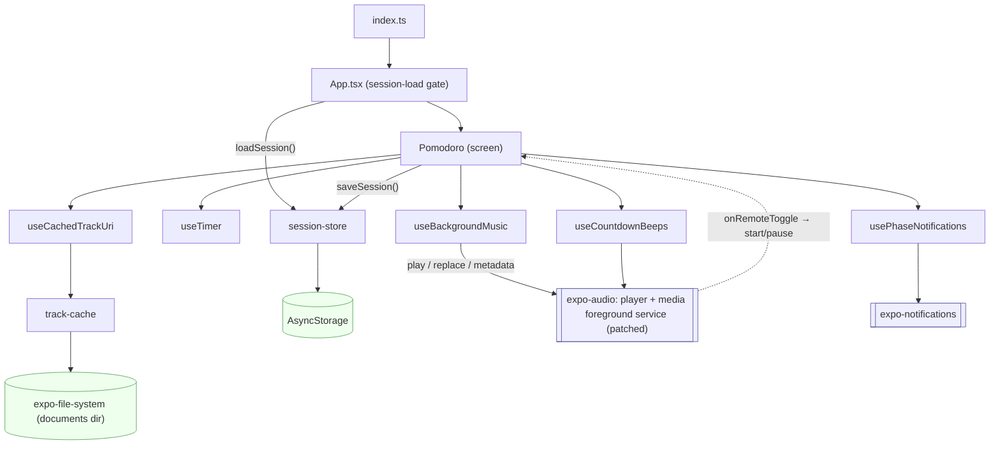
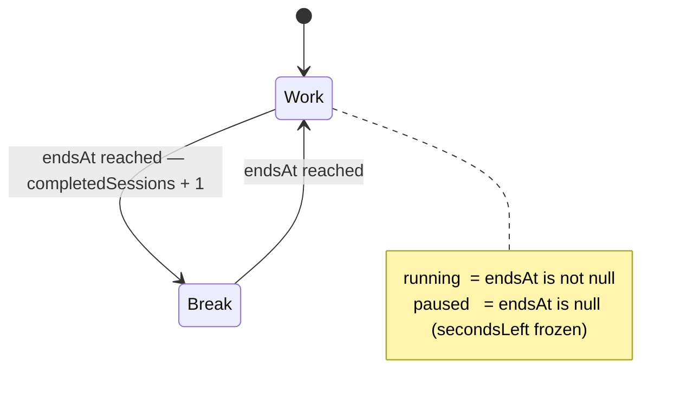
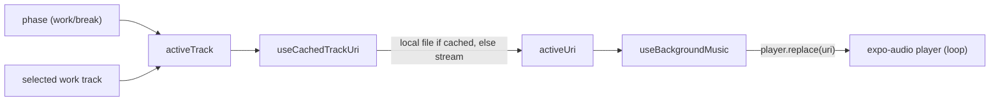
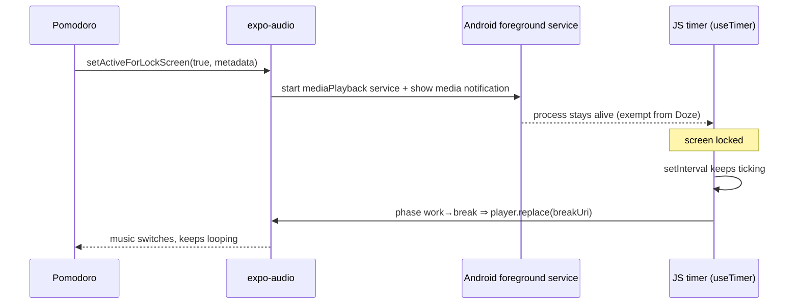
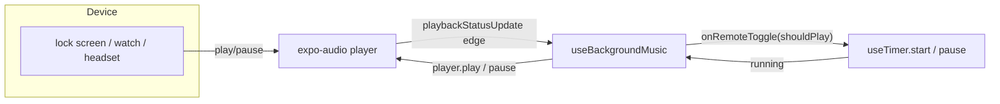
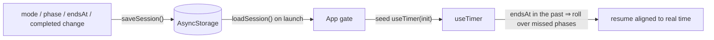

# Architecture

This document describes how the Pomodoro app is put together: its modules, how
state flows, and — most importantly — how it keeps the timer and music alive
while the phone is locked, and how the timer and the media card stay in sync.

For setup and features see [`README.md`](./README.md).

## Overview

The app is a single screen with no navigation. `index.ts` registers `App.tsx`,
whose default export is a small **gate** that restores the persisted session
before mounting the real UI component, `Pomodoro`. `Pomodoro` owns the
list-level state (selected mode and work track) and composes a handful of
focused hooks; there is no state-management library and no shared store.

| Module | Responsibility |
| --- | --- |
| `App.tsx` | Gate that loads the session, then renders `Pomodoro`; wires the hooks and persists the session |
| `src/hooks/useTimer.ts` | Wall-clock countdown; auto-switches work ↔ break; `start`/`pause`/`reset` |
| `src/hooks/useBackgroundMusic.ts` | Loops the phase's track; runs the lock-screen/foreground session; reports remote play/pause back to the timer |
| `src/hooks/useCachedTrackUri.ts` | Resolves a track to a local (preferred) or remote uri |
| `src/lib/track-cache.ts` | Downloads tracks once to local storage (atomic `.part` + rename) |
| `src/hooks/usePhaseNotifications.ts` | Schedules a local notification at each phase end |
| `src/hooks/useCountdownBeeps.ts` | Beeps in the last 5 seconds of a phase |
| `src/lib/session-store.ts` | Persists/restores the session snapshot in AsyncStorage |
| `patches/expo-audio+1.1.1.patch` | Native patch so the media-card progress bar tracks the pomodoro phase, not the audio file |
| `src/constants/*` | Mode presets, track catalog, private streaming URLs |

## Timer model

The timer never counts interval ticks. It stores `endsAt` — the epoch
millisecond at which the current phase ends — and derives the remaining seconds
from the wall clock. This is what makes it correct after the OS suspends
JavaScript: on resume (an interval tick or an `AppState` "active" event) it
recomputes from `endsAt`, and if the end already passed it rolls the phase over,
staying aligned to real time.

## How music follows the phase

The active track is pure derived state: the phase (plus the selected work
track) picks a `Track`, `useCachedTrackUri` turns it into a playable uri, and
`useBackgroundMusic` drives one reused `expo-audio` player. Because
`useAudioPlayer` does not react to source changes, the hook swaps the source
explicitly with `player.replace()` on every uri change.

## Background survival (the important part)

The single most important design decision: **the media-playback foreground
service is what keeps the app process — and therefore the JS timer — alive
while the screen is locked.**

`useBackgroundMusic` calls `player.setActiveForLockScreen(true, …)`. That
starts expo-audio's Android `mediaPlayback` foreground service and shows a
media notification. With the process kept alive, the JS timer keeps ticking in
the background, so the phase flips on time and the music switches from work to
break. Without it, Android Doze suspends JavaScript: the phase never changes,
the work track keeps looping into the break, and playback eventually dies.

Supporting choice — **`interruptionMode: 'mixWithOthers'`**: the player never
requests exclusive audio focus, so a notification, another app, or a system
sound can't steal focus and pause the music (the common cause of playback
"just stopping"). Trade-off: the music also won't pause for a phone call;
switch to `'doNotMix'` if that's preferred.

## The media card IS the pomodoro

The lock-screen media card is repurposed as the timer's remote face. Its text
is refreshed every second (the foreground service keeps JS alive to do it) via
`updateLockScreenMetadata`, and its progress bar is driven by the pomodoro, not
the audio file:

- **Title** — `mm:ss · <phase>` (e.g. `12:34 · Trabajo`).
- **Artist** — `Pomodoro · <work track>` (or just `Pomodoro` on a break).
- **`albumTitle`** — not shown; it smuggles a progress payload
  `pomodoro:<phaseDurationMs>:<endsAt|-1>:<pausedRemainingMs|-1>` to the native
  side.

A `patch-package` patch (`patches/expo-audio+1.1.1.patch`, applied on
`postinstall`) wraps the media session's player in a `ForwardingPlayer` that
parses that payload and reports the pomodoro's duration/position as the track's
duration/position — so the card's progress bar tracks the phase countdown. The
patch also hides the seek bar (seeking looping music is meaningless) and keeps
the payload out of the visible UI. If `expo-audio` is upgraded, the patch must
be regenerated or dropped consciously.

## Remote controls drive the timer

Play/pause from the lock screen, a smartwatch, or a headset button controls the
**timer**, not just the music — so the two never drift apart.
`useBackgroundMusic` watches `playbackStatusUpdate` for a real edge in the
player's playing state that contradicts the current `playing` prop, and calls
`onRemoteToggle`, which the screen wires to `start`/`pause`. Transient states
(buffering, and the brief pause emitted while a track is swapped on a phase
change) are filtered out so they aren't mistaken for a user action.

## Surviving a process kill

A foreground service makes a background kill rare, not impossible. As defense
in depth, the session is persisted and restored so an OS kill doesn't reset
everything (mode, phase, remaining time, completed count).

Because the timer is anchored to `endsAt`, restoring a running session "just
works": the wall-clock resync treats a process kill exactly like a long
suspension. Writes are throttled to phase/transition changes (only the paused
remaining is stored explicitly), so persistence does not write on every
one-second tick.

## Testing notes

There is no device in CI, so native behavior (the foreground service, the
patched media session, real audio, notifications) is verified manually on a
development build (`npm run deploy`). The Jest suite covers the JS logic with
manual mocks for `expo-audio`, `expo-notifications`, `expo-file-system` and
AsyncStorage — including the remote play/pause edge detection and the media-card
metadata payload. `App.test.tsx` renders the inner `Pomodoro` with an explicit
`initial` prop to stay synchronous, and separately exercises the async gate.
